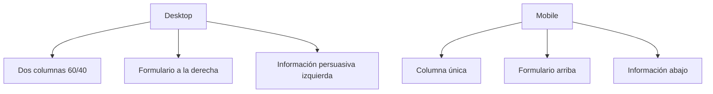

# Plan de Implementación de Página de Pago

## 📋 Resumen Ejecutivo

Se implementará una página de pago dedicada con diseño visual atractivo que redirige desde los planes de precios. La página incluirá formulario de información personal, integración con Stripe, y elementos persuasivos para aumentar la conversión.

## 🎯 Objetivos

- Crear experiencia de pago fluida y visualmente atractiva
- Mantener consistencia con el diseño actual de la aplicación
- Integrar con el sistema existente de Supabase y Stripe
- Optimizar la tasa de conversión mediante elementos persuasivos

## 🏗️ Arquitectura de Componentes

### 1. Estructura de Archivos

```
src/
├── pages/
│   ├── PaymentPage.tsx          # Página principal de pago
│   └── PaymentSuccess.tsx       # Página de confirmación
├── components/
│   ├── PaymentForm.tsx          # Formulario de información personal
│   ├── StripeCardForm.tsx       # Formulario de tarjeta de Stripe
│   └── PaymentPersuasion.tsx    # Elementos persuasivos
└── lib/
    └── paymentUtils.ts          # Utilidades de pago
```

### 2. Componentes Principales

#### PaymentPage.tsx
- **Layout**: Dos columnas responsivas
- **Columna izquierda**: Logo, beneficios, seguridad, testimonios
- **Columna derecha**: Formulario de pago completo
- **Características**: Animaciones, responsive, accesibilidad

#### PaymentForm.tsx
- **Campos**: Nombre completo, dirección, código postal
- **Validación**: React Hook Form + Zod
- **UI**: Componentes shadcn/ui (Input, Label, Card)
- **Estilo**: Consistente con diseño actual

#### StripeCardForm.tsx
- **Integración**: @stripe/react-stripe-js
- **Componentes**: CardElement, Elements
- **Manejo**: Errores, loading states
- **Seguridad**: Tokenización de tarjeta

## 🎨 Diseño Visual

### Esquema de Colores
- **Primario**: gradiente-brand (existente)
- **Secundario**: bg-surface, text-muted-foreground
- **Éxito**: verde (confirmación)
- **Error**: rojo (errores de pago)

### Layout Responsivo


### Elementos Persuasivos
- Logo de Klywo con animación
- Sellos de seguridad (SSL, Pagos seguros)
- Testimonios de clientes
- Garantía de reembolso
- Comparativa de beneficios
- Contador de usuarios activos

## 🔧 Implementación Técnica

### 1. Integración con Rutas
- Modificar `src/App.tsx` para agregar ruta `/payment`
- Actualizar `src/components/Pricing.tsx` para redirigir
- Pasar parámetros del plan seleccionado

### 2. Flujo de Datos
```typescript
interface PaymentData {
  planName: string;
  priceId: string;
  amount: number;
  currency: string;
  userInfo: {
    fullName: string;
    address: string;
    postalCode: string;
  };
}
```

### 3. Manejo de Estado
- React Query para manejo de estado asíncrono
- Context para datos de pago compartidos
- LocalStorage para persistencia temporal

## 📱 Características de UX

### 1. Indicadores de Progreso
- Barra de progreso del proceso
- Estados visuales claros
- Feedback inmediato de acciones

### 2. Validación en Tiempo Real
- Validación de campos mientras el usuario escribe
- Mensajes de error específicos
- Ayuda visual para campos requeridos

### 3. Accesibilidad
- Labels ARIA
- Navegación por teclado
- Contraste de colores adecuado
- Mensajes de pantalla lectora

## 🔒 Seguridad

### 1. Integración Stripe
- Tokenización de tarjetas
- Manejo seguro de datos sensibles
- Webhook para confirmación de pagos

### 2. Validación de Datos
- Validación en frontend y backend
- Sanitización de inputs
- Protección contra XSS

## 📊 Métricas de Éxito

- Tasa de conversión de pago
- Tiempo promedio de finalización
- Tasa de errores de formulario
- Satisfacción del usuario

## 🚀 Implementación

### Fase 1: Estructura Base
1. Crear archivo `PaymentPage.tsx`
2. Configurar ruta en `App.tsx`
3. Implementar layout básico

### Fase 2: Formularios
1. Crear `PaymentForm.tsx`
2. Crear `StripeCardForm.tsx`
3. Integrar validación

### Fase 3: Elementos Visuales
1. Agregar componentes persuasivos
2. Implementar animaciones
3. Optimizar responsive

### Fase 4: Integración
1. Conectar con Pricing.tsx
2. Probar flujo completo
3. Depurar y optimizar

## 🎨 Mockup Visual

```
┌─────────────────────────────────────────────────────────────┐
│ KLYWO - Plataforma de Gestión de Chats                      │
├─────────────────────────────────────────────────────────────┤
│ ┌─────────────────────┐ ┌─────────────────────────────────┐ │
│ │                     │ │                                 │ │
│ │  🎯 PLAN SELECCIONADO │ │ 📝 FORMULARIO DE PAGO          │ │
│ │                     │ │                                 │ │
│ │  Plan: Growth       │ │ Nombre Completo:               │ │
│ │  Precio: $39/mes    │ │ [___________________________]  │ │
│ │                     │ │                                 │ │
│ │  ✨ BENEFICIOS      │ │ Dirección:                     │ │
│ │  • 10 agentes       │ │ [___________________________]  │ │
│ │  • Todos los canales│ │                                 │ │
│ │  • Soporte 24/7     │ │ Código Postal:                │ │
│ │                     │ │ [_____]                        │ │
│ │ 🔒 SEGURIDAD        │ │                                 │ │
│ │  • SSL Certificado  │ │ 💳 TARJETA DE CRÉDITO          │ │
│ │  • Pagos seguros    │ │ [•••• •••• •••• 1234]          │ │
│ │                     │ │                                 │ │
│ │ 🏆 CLIENTES SATISF. │ │ MM/YY   [__/__]   CVV [___]    │ │
│ │  • 1,000+ empresas  │ │                                 │ │
│ │  • 99% satisfacción │ │ [💳 PAGAR AHORA $39]            │ │
│ │                     │ │                                 │ │
│ └─────────────────────┘ └─────────────────────────────────┘ │
├─────────────────────────────────────────────────────────────┤
│ 🛡️ Garantía de reembolso de 30 días | Soporte 24/7        │
└─────────────────────────────────────────────────────────────┘
```

## 📝 Notas de Implementación

1. **Consistencia**: Usar los mismos componentes UI que ya existen
2. **Performance**: Lazy loading de componentes pesados
3. **Testing**: Probar en diferentes dispositivos y navegadores
4. **Analytics**: Integrar seguimiento de conversiones