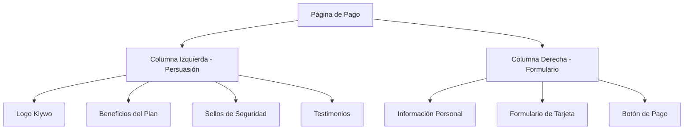

# Plan de Implementación Visual de Página de Pago

## 📋 Enfoque Exclusivo en lo Visual

Entendido. Me enfocaré únicamente en la parte visual sin modificar la lógica existente de backend, base de datos ni integración con Stripe.

## 🎯 Restricciones Claras

- **NO modificar**: Lógica de Supabase, funciones existentes, estructura de base de datos
- **NO modificar**: Integración con Stripe, webhooks, manejo de pagos
- **NO modificar**: Componentes existentes de autenticación o pricing
- **SÍ enfocar**: Solo en la capa visual y experiencia de usuario

## 🎨 Implementación Visual Puramente

### 1. Modificación de Pricing.tsx (Solo UI)
```typescript
// Cambio visual en el botón "Get Started"
// De: onClick={() => handleGetStarted(plan.name, priceId)}
// A: onClick={() => navigate(`/payment?plan=${plan.name}&priceId=${priceId}`)}

// Solo cambios de estilo, no de lógica
```

### 2. Creación de PaymentPage.tsx (Solo Visual)
- Componente puramente visual
- Reutiliza lógica existente de Stripe
- Solo manejo de estado para UI (loading, errors)
- Sin modificar la lógica de backend

### 3. Elementos Visuales a Agregar

#### Layout de Dos Columnas


#### Componentes Visuales
- **Logo animado**: Klywo con efectos visuales
- **Tarjetas de beneficios**: Iconos + texto persuasivo
- **Sellos de seguridad**: SSL, Pagos protegidos
- **Indicadores de progreso**: Barra visual del proceso
- **Micro-interacciones**: Hover effects, transiciones

### 4. Paleta de Colores y Estilos

#### Colores Existentes (Usar los mismos)
- `bg-gradient-brand` - Gradiente principal
- `text-primary` - Textos primarios
- `bg-surface` - Fondo de superficies
- `border-border` - Bordes

#### Nuevos Elementos Visuales
- **Gradientes sutiles** para fondos
- **Sombras suaves** para profundidad
- **Animaciones CSS** para engagement
- **Iconos consistentes** con Lucide React

### 5. Componentes a Crear (Solo UI)

#### PaymentPage.tsx
```typescript
// Solo estructura visual, sin lógica de negocio
const PaymentPage = () => {
  return (
    <div className="min-h-screen bg-gradient-to-br from-surface to-background">
      <div className="container mx-auto px-4 py-8">
        <div className="grid lg:grid-cols-2 gap-8 items-center">
          {/* Columna izquierda - Solo visual */}
          <div className="space-y-6">
            <LogoKlywo />
            <PlanBenefits />
            <SecurityBadges />
            <Testimonials />
          </div>
          
          {/* Columna derecha - Solo visual */}
          <div className="space-y-6">
            <PaymentForm />
            <StripeCardForm />
            <PayButton />
          </div>
        </div>
      </div>
    </div>
  );
};
```

#### PaymentForm.tsx
```typescript
// Solo UI, reutiliza lógica existente
const PaymentForm = () => {
  return (
    <Card className="p-6">
      <h3 className="text-lg font-semibold mb-4">Información Personal</h3>
      <div className="space-y-4">
        <Input placeholder="Nombre completo" />
        <Input placeholder="Dirección" />
        <Input placeholder="Código postal" />
      </div>
    </Card>
  );
};
```

### 6. Integración con Sistema Actual

#### Modificación Mínima en Pricing.tsx
```typescript
// Solo cambio de navegación, no de lógica
const handleGetStarted = (planName: string, priceId: string) => {
  // Lógica existente de Stripe se mantiene igual
  if (!stripe) return;
  
  // Solo se agrega redirección visual
  navigate(`/payment?plan=${planName}&priceId=${priceId}`);
};
```

#### App.tsx - Agregar Ruta Visual
```typescript
// Solo agregar ruta, sin modificar lógica existente
<Route path="/payment" element={<PaymentPage />} />
```

### 7. Elementos Persuasivos Visuales

#### Diseño Persuasivo
- **Urgencia**: "Oferta limitada", "Usuarios ya se unieron"
- **Social proof**: "1,000+ empresas confían en nosotros"
- **Garantías**: "Garantía de 30 días", "Soporte 24/7"
- **Comparativas**: Beneficios visuales vs competencia

#### Elementos Visuales
- **Contadores animados** de usuarios
- **Sellos de seguridad** con iconos
- **Testimonios con fotos** de clientes
- **Beneficios con iconos** ilustrativos

### 8. Responsive Design

#### Desktop
- Dos columnas 60/40
- Formulario a la derecha
- Información persuasiva a la izquierda

#### Mobile
- Columna única
- Formulario arriba
- Información abajo
- Botones grandes para fácil toque

### 9. Animaciones y Micro-interacciones

#### Transiciones Suaves
- Fade-in en carga de página
- Scale effects en botones
- Slide animations en elementos
- Loading states visuales

#### Feedback Visual
- Cambios de color en hover
- Estados de loading claros
- Mensajes de error visuales
- Confirmaciones animadas

### 10. Accesibilidad Visual

#### Contraste y Legibilidad
- Textos con suficiente contraste
- Tamaños de fuente adecuados
- Espaciado correcto entre elementos
- Iconos con labels descriptivos

#### Navegación por Teclado
- Focus visible en todos los elementos
- Navegación lógica con tab
- Accesibilidad en formularios

## 📋 Checklist de Implementación Visual

### ✅ Elementos a Modificar (Solo UI)
- [ ] Crear PaymentPage.tsx - estructura visual
- [ ] Crear PaymentForm.tsx - formulario visual
- [ ] Crear StripeCardForm.tsx - formulario de tarjeta visual
- [ ] Modificar Pricing.tsx - solo cambio de navegación
- [ ] Agregar ruta en App.tsx - solo visual
- [ ] Implementar elementos persuasivos visuales
- [ ] Agregar animaciones y micro-interacciones
- [ ] Optimizar responsive design
- [ ] Implementar accesibilidad visual

### ✅ Elementos NO a Modificar
- [ ] Lógica de Supabase existente
- [ ] Funciones de Stripe
- [ ] Webhooks
- [ ] Base de datos
- [ ] Autenticación
- [ ] Componentes de negocio

## 🎯 Resultado Esperado

Una página de pago visualmente atractiva que:
- Mejore la experiencia de usuario
- Aumente la tasa de conversión
- Sea consistente con el diseño actual
- No afecte la funcionalidad existente
- Sea completamente responsiva
- Tenga elementos persuasivos visuales